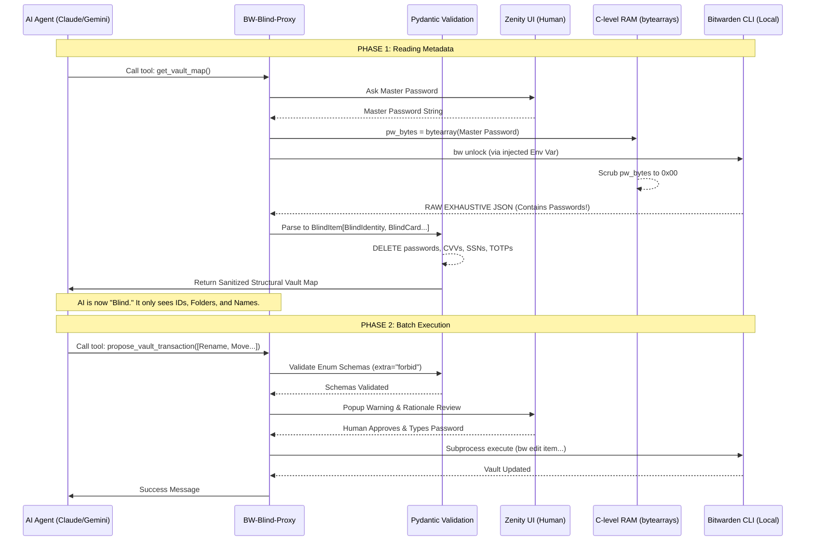

# BW-Blind-Proxy 🔐🤖

**Sovereign, Exhaustive, & Ultra-Secure Model Context Protocol (MCP) for Bitwarden**

**BW-Blind-Proxy** is a specialized, air-gapped intermediary designed to physically isolate Large Language Models (LLMs) from your Bitwarden cryptographic secrets, while still granting them 100% organizational superpowers over your vault.

It strongly enforces the **"AI-Blind Management"** philosophy. You can ask an AI (Claude, Cursor, Gemini) to completely reorganize your vault, rename poorly formatted accounts, manage your Enterprise Collections, update credit card expiration dates, or tag hundreds of items as favorites. *The AI will do all of this flawlessly, without ever being able to read or modify your Master Password, your TOTP seeds, your Credit Card CVVs, or your Social Security Number.*

---

## 🏗️ The Architecture of the Proxy

The transparency of this proxy is its greatest strength. Here is exactly how an AI interacts with your vault.



### The 4 Pillars of Defense

1. **AI-Blind Read Operations:** The AI reads structural metadata. `password`, `totp`, `notes` (Secure Notes), `number` (CC), `code` (CVV), `ssn` (Identity), `passportNumber`, and "Hidden" Custom Fields are instantly overwritten with `"[REDACTED_BY_PROXY]"` by Pydantic before the LLM sees the JSON.
2. **Strict Polymorphic Pydantic Schemas:** The AI **CANNOT** execute wild bash commands. It can only propose from a hardcoded list of 15 `Enum` atomic actions. If a rogue AI tries to slip `"password": "hacked"` into a `RenameItem` payload, Pydantic's `extra="forbid"` rule immediately detonates the payload and aborts the transaction.
3. **Hardware-Level Memory Wiping:** The `BW_SESSION` key and your Master Password are fundamentally obliterated from Python memory immediately after usage. Instead of relying on Python's Garbage Collector (which leaves strings floating in RAM for hackers to dump), the proxy converts keys to raw `bytearray` matrices and systematically overwrites them with zeroes (`0x00`).
4. **Red Alerts on Destructive Actions:** Modifying an item logs a blue UI prompt. Deleting an item/folder triggers a native Red Warning Zenity Box to guarantee a human doesn't sleepwalk into approving an AI's destructive hallucination.

---

## 🛠️ Exhaustive API Coverage (15 Enum Actions)

The proxy maps Bitwarden's complex CLI into 15 robust, completely secure internal Enums.

### Item Organization (`ItemAction`)
1. **`rename_item`**: Safely alters the name of a secret.
2. **`move_item`**: Reparents an item inside a specific Folder UUID.
3. **`favorite_item`**: Toggles the star/favorite status.
4. **`delete_item`**: [🚨 RED ALERT] Removes item to the Trash.
5. **`restore_item`**: [Phase 4 Edge] Recovers an item from the Trash.
6. **`toggle_reprompt`**: [Phase 4 Edge] Enables/Disables Master Password Reprompt requirement for specific high-value items.
7. **`move_to_collection`**: [Phase 4 Edge] Enterprise Organization sharing mapping.
8. **`delete_attachment`**: [Phase 4 Edge] Forcefully removes physical file attachments.

### Folder Operations (`FolderAction`)
9. **`create_folder`**: Instantiates a new logical grouping.
10. **`rename_folder`**: Self-explanatory.
11. **`delete_folder`**: [🚨 RED ALERT] Deletes the folder (does not delete the items inside, they go to root).

### Granular PII Editing (`EditAction`)
To edit an item, the Python Subprocess grabs the full hidden JSON locally, surgicaly injects the AI's safe modification, and pushes it back up.
12. **`edit_item_login`**: Safely updates `Username` & `URIs`. (Strictly rejects attempts to edit `password` or `totp`).
13. **`edit_item_card`**: Safely updates Expiration Dates, Name, & Brand. (Strictly rejects Credit Card Number & CVV edits).
14. **`edit_item_identity`**: Safely updates Standard Address & Contact Info. (Strictly rejects SSN, Passport, and License edits).
15. **`upsert_custom_field`**: Adds/updates unstructured metadata. (Strictly limited to `Type 0: Text` and `Type 2: Boolean`. The AI is blocked from reading or altering `Type 1: Hidden` or `Type 3: Linked` secrets).

---

## 🚀 Installation & Usage

### Requirements
- Python `>= 3.12`
- `uv` package manager (`curl -LsSf https://astral.sh/uv/install.sh | sh`)
- `bw` (Bitwarden CLI) installed and logged in.
- `zenity` installed on Linux (`sudo apt install zenity`) for the GUI prompts.

### Build and Install Globally
Provide the tool to your system via `uv`:
```bash
uv tool install . --force
```

### Adding to an MCP Client
Add the following to your Claude/Cursor configurations, or your `gemini-cli` config:
```json
{
  "mcpServers": {
    "bw-blind-proxy": {
      "command": "bw-blind-proxy",
      "args": []
    }
  }
}
```

---

## 📖 Deep Dives & Simulations
To truly trust a sovereign proxy, you must understand how it behaves in extreme edge cases. Read these explicit simulations in the `docs/` folder:

* `docs/bitwarden_architecture.md`: Explains the granular anatomy of the Bitwarden schemas and the reverse-engineering used for the Proxy's defense model.
* `docs/simulation_exhaustive.md`: The base AI negotiation cycle and memory wiping.
* `docs/simulation_organization.md`: Complex orchestration and batching logic.
* `docs/simulation_destruction.md`: How the Red Alert systems protect against malicious AI deletions.
* `docs/simulation_advanced_types.md`: How Pydantic obliterates AI attempts to modify PII and Custom Hidden Fields.
* `docs/simulation_extreme_edge.md`: *(See actual file for Phase 4 Trash/Collection/Reprompt capabilities)*.

---
**Maintained with 100% transparency. Your secrets remain yours.**
